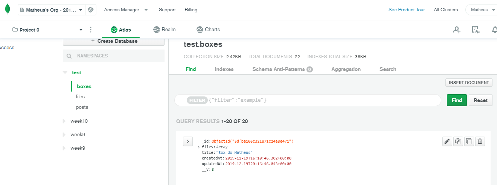
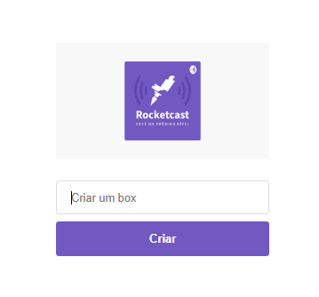

# Semana Omnistack6 - RocketSeat
## Meu primeiro projeto utilizando a stack NodeJS, ReactJS e ReactNative.
### Foi desenvolvido um software baseado no dropbox, os arquivos são armazenados em tempo real no MongoDB

### BackEnd - Desenvolvido em NodeJS
##### Principais bibliotecas
- **Expess** -> Trabalhando com rotas
- **Mongoose** -> Banco de dados com MongoDB
- **Multer** -> Armazenamento de arquivos
- **Socket.io** -> Funcionamento em tempo real
- **Cors** -> Definidno a segurança da API

### FrontEnd - Web - Desenvolvido em ReactJS
##### Principais bibliotecas
- **Axios** -> Responsável por consumir a api
- **React Router Dom** -> Responsável pelo funcionamento das rotas
- **React Icons** -> Inserindo icones padrões do React
- **Date FNS** -> Trabalhando com datas
- **React DropZone** -> Habilita opção de arrastar arquivos
- **Socket.io** -> Atualizando a visualização de arquivos automaticamente

### FrontEnd - Mobile - Desenvolvido com ReactNative
##### Principais bibliotecas
- **Axios** -> Responsável por consumir a api
- **Community/async-storage** -> Armazenar arquivos no banco de dados local
- **Vector Icons** -> Inserindo o icones
- **React Native FS** -> Lidando com os arquivos
- **Socket.io** -> Atualizando a visualização de arquivos automaticamente

