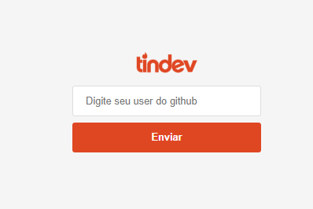
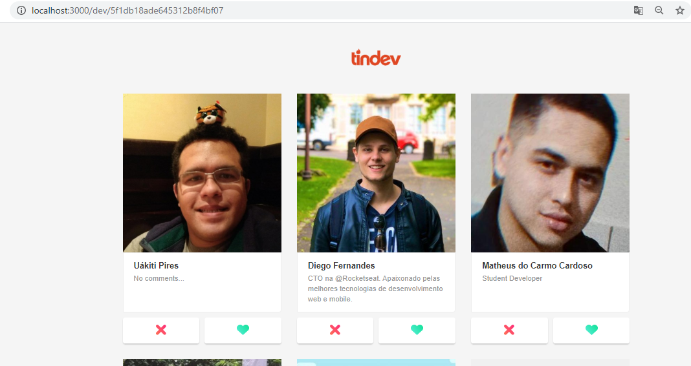

# Semana Omnistack8 - RocketSeat

### Projeto desenvolvido utilizando utilizando a stack NodeJS, ReactJS.
### Trata-se de uma cópia do Tinder com objetivo de buscar desenvolvedores que trabalham que a mesma tecnologia que você.
### O Usuário se cadastra utilizando a api do github.

### BackEnd - Desenvolvido em NodeJS
##### Principais bibliotecas
- **Expess** -> Trabalhando com rotas
- **Mongoose** -> Banco de dados com MongoDB
- **Multer** -> Armazenamento de arquivos
- **Socket.io** -> Funcionamento em tempo real
- **Cors** -> Definidno a segurança da API

### FrontEnd - Web - Desenvolvido em ReactJS
##### Principais bibliotecas
- **Axios** -> Responsável por consumir a api
- **React Router Dom** -> Responsável pelo funcionamento das rotas
- **React Icons** -> Inserindo icones padrões do React
- **Date FNS** -> Trabalhando com datas
- **React DropZone** -> Habilita opção de arrastar arquivos
- **Socket.io** -> Atualizando a visualização de arquivos automaticamente

